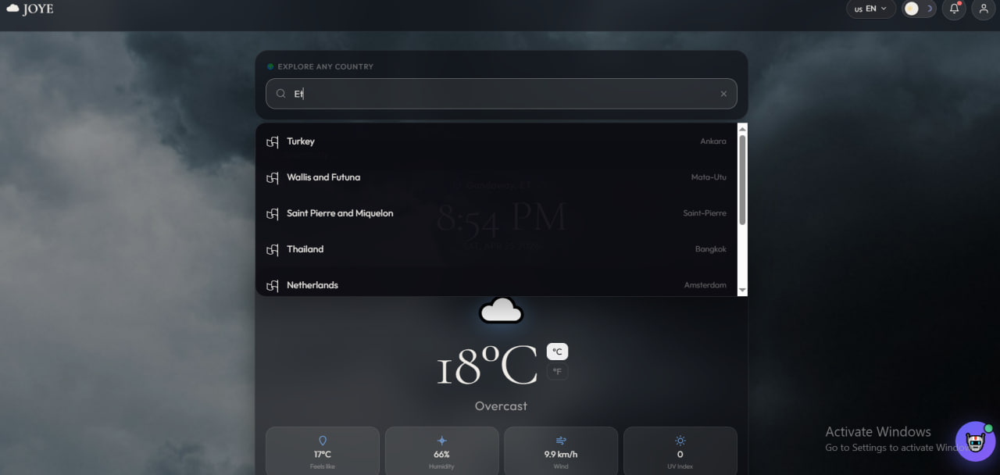
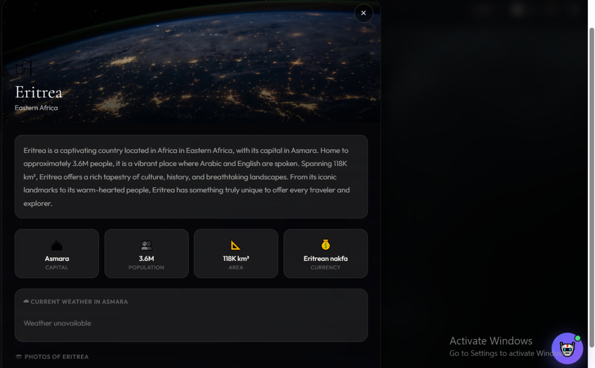
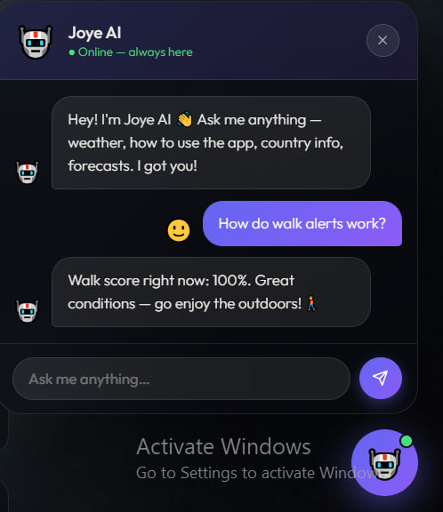
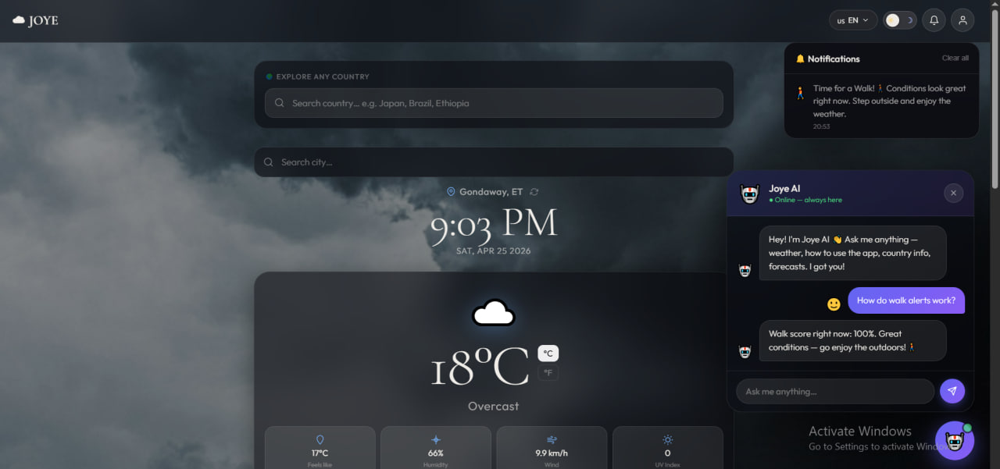

<div align="center">


# JOYE Weather 🌤

**Your world. Your weather.**

A stunning Progressive Web App for real-time weather, global country exploration, and AI-powered assistance — built with zero dependencies, pure HTML, CSS & JavaScript.

[](https://joyceweatherapp.vercel.app)
[](https://joyceweatherapp.vercel.app)
[](LICENSE)
[](https://joyceweatherapp.vercel.app)
[](https://joyceweatherapp.vercel.app)

</div>

---

## ✨ Screenshots

<div align="center">

| 🏠 Landing | 🔐 Register |
|:---:|:---:|
|  |  |

| 🌍 Country Search | 📋 Country Detail |
|:---:|:---:|
|  |  |

| 🤖 Joye AI | 📊 Full Dashboard |
|:---:|:---:|
|  |  |

</div>

---

## 🚀 Features

| Feature | Description |
|---------|-------------|
| 🌡 **Live Weather** | Auto-detects your location, fetches real-time conditions |
| 🏙 **City Search** | Search any city worldwide and get instant weather |
| 🌍 **Country Explorer** | Full country profiles — intro, stats, weather, 7-day forecast & photos |
| 📅 **7-Day Forecast** | Daily high/low with weather icons |
| ⏱ **Hourly Forecast** | 24-hour scrollable timeline |
| 👕 **Outfit Suggestions** | What to wear based on current conditions |
| 🚶 **Walk Score** | Rates how good conditions are for a walk (0–100%) |
| 🔔 **Walk Alerts** | Push notifications when it's perfect to go outside |
| 🤖 **Joye AI** | Built-in AI assistant — answers weather questions & guides you through the app |
| 🌅 **Sun Tracker** | Sunrise/sunset times with a live progress arc |
| 🌡 **°C / °F Toggle** | Switch units anytime, saved to preference |
| 🌙 **Dark / Light Mode** | Smooth theme switching, persisted locally |
| 🌐 **4 Languages** | English 🇺🇸 · Amharic 🇪🇹 · Afaan Oromoo 🇪🇹 · Somali 🇸🇴 |
| 📱 **PWA** | Installable on mobile & desktop, works offline |

---

## 🗂 Project Structure

```
JOYE Weather/
├── index.html              # Sign-in / landing page
├── dashboard.html          # Main weather dashboard
├── manifest.json           # PWA manifest
├── sw.js                   # Service worker (offline support)
├── README.md
│
├── css/
│   ├── style.css           # Landing page styles
│   └── dashboard.css       # Dashboard + chatbot + country modal styles
│
├── js/
│   ├── app.js              # Auth, language switching, slideshow
│   └── dashboard.js        # Weather, country explorer, Joye AI chatbot
│
├── icons/
│   ├── icon.svg            # App icon
│   └── generate-icons.html # Icon generator utility
│
└── screenshots/            # App screenshots for README
```

---

## 🔌 APIs Used

| API | Purpose | Key Required |
|-----|---------|:---:|
| [Open-Meteo](https://open-meteo.com) | Weather data & forecasts | ❌ Free |
| [Open-Meteo Geocoding](https://open-meteo.com/en/docs/geocoding-api) | City search | ❌ Free |
| [Nominatim / OpenStreetMap](https://nominatim.org) | Reverse geocoding | ❌ Free |
| [REST Countries](https://restcountries.com) | Country data & flags | ❌ Free |
| [Unsplash Source](https://source.unsplash.com) | Country photos | ❌ Free |

> **No API keys needed.** Everything is free and open.

---

## ⚡ Getting Started

> **🌐 Try it live → [joyceweatherapp.vercel.app](https://joyceweatherapp.vercel.app)**

No build step, no dependencies, no config. Just open and run.

```bash
# Clone the repo
git clone https://github.com/your-username/joye-weather.git
cd joye-weather

# Serve with Python
python -m http.server 8080

# Or with Node
npx serve .

# Or just open index.html directly in your browser
```

Then visit `http://localhost:8080`

---

## 📱 Install as PWA

**Mobile (iOS/Android):** Open in browser → tap Share → "Add to Home Screen"

**Desktop (Chrome/Edge):** Look for the install icon (⊕) in the address bar

---

## 🌐 Languages

JOYE supports 4 languages switchable from the top-right language selector:

- 🇺🇸 **English**
- 🇪🇹 **Amharic** (አማርኛ)
- 🇪🇹 **Afaan Oromoo**
- 🇸🇴 **Somali** (Soomaali)

---

## 🤖 Joye AI — What Can It Do?

Click the purple 🤖 button (bottom-right) to open the AI assistant. It can:

- Tell you the current weather, temperature, UV index, humidity & wind
- Give outfit recommendations based on conditions
- Show your walk score and explain walk alerts
- Guide you through every feature in the app
- Answer questions about any country you're exploring
- Explain forecasts, sunrise/sunset, and more

---

## 📋 Version History

### v1.0.0 — April 2026
- ✅ Full weather dashboard with live Open-Meteo data
- ✅ Country explorer (195+ countries) with weather + photos
- ✅ Joye AI chatbot with contextual weather awareness
- ✅ PWA — installable, offline-capable
- ✅ Multi-language support (EN, AM, OM, SO)
- ✅ Dark / light mode
- ✅ Walk alerts with push notifications
- ✅ Outfit suggestions engine
- ✅ Hourly + 7-day forecasts
- ✅ Sun tracker with progress arc

---

## 📄 License

MIT License — free to use, modify, and distribute.

---

<div align="center">

Made with ☁ and a lot of ☕ — **JOYE Weather v1.0**

**[🚀 Open the App](https://joyceweatherapp.vercel.app)**

</div>
